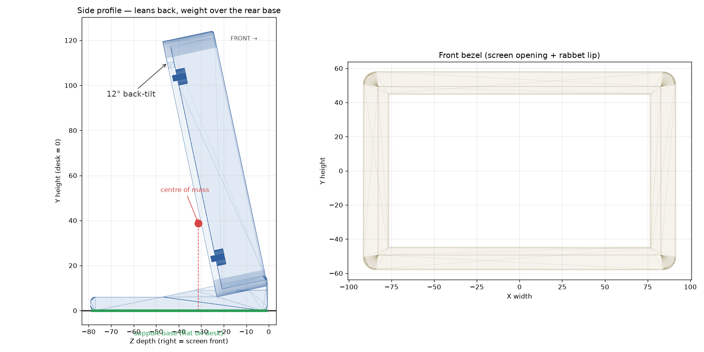

# Ingcool 7" Mini Monitor Case — tilted desktop stand

Parametric CadQuery model for a 3D-printable case for the ingcool 7DP-CAPLCD
(Rev4.1, HDMI + capacitive-touch) 7" driver board. The case rests on a
**slight backward tilt** so the centre of mass is shifted rearward and the
screen can't tip forward under its own weight.



## The tilt (the requested feature)

The backward lean is **built into the rear shell** as a fixed wedge base —
no fold-out kickstand, no moving parts, nothing to adjust or wear out. When
you set it on a desk it always sits at the same gentle recline, with a flat
full-contact footprint (no rocking) and a rearward heel so the weight lands
well inside the support base.

The side-profile render above shows the centre-of-mass plumb line dropping
squarely inside the flat base — the numeric stability check that the build
prints confirms it:

```
--- Stability check (integrated tilt) ---
  TILT_ANGLE      : 12.0 deg backward
  Centre of mass  : X=-0.0  Y=38.7  Z=-31.2
  Base footprint Z: rear tip -79.1 .. front toe -0.6
  CoM inside base : OK   (rear margin 47.9 mm, front margin 30.6 mm)
```

### Changing the tilt

Everything about the base derives from one parameter at the top of
`case_design.py`:

```python
TILT_ANGLE = 12.0   # degrees of backward lean ("slight")
```

Set it to ~10° for a subtler lean, ~15–20° for a more reclined desk-monitor
posture, then re-run — the wedge, footprint and heel all recompute. Related
base knobs: `BASE_REAR_EXT` (heel depth behind the shell), `BASE_HEEL_H`
(min base thickness), `CABLE_CH_W/H` (under-case cable channel).

## Design notes / decisions

- **Integrated tilt instead of the prior fold-out kickstand.** The earlier
  handoff design achieved a backward lean with a piano-hinge kickstand. This
  version bakes the lean into the shell instead. It's the most robust answer
  to "sits on a slight tilt leaning back": always stable, no free-friction
  hinge that could sag under load, and it inherently provides the fixed
  angle stop the handoff had listed as an open item. If you'd prefer the
  adjustable/foldable kickstand instead, say so and it can be added back.
- **Cable routing:** the HDMI / touch-USB ports are on the bottom edge; a
  channel is cut through the base directly under them so cables drop into a
  tunnel and exit front or rear. Widen `CABLE_CH_W` if you reposition ports.
- **Still "VERIFY":** `PANEL_W/H`, `MOUNT_INSET_X/Y`, and the port X
  positions (`HDMI_FRAC`, `USB_FRAC`) are estimated from the published spec.
  Measure the actual board with calipers and update these five — that's the
  biggest remaining fit risk.

## Parts

| File | What it is |
|---|---|
| `case_design.py` | Single source file — generates both parts + stability check |
| `front_bezel.step` / `.stl` | Screen bezel with rabbet lip |
| `rear_shell.step` / `.stl` | Back shell: cavity, standoffs, ports, vent, tilt base |
| `case_preview.png` | Side profile + bezel render |

STEP is for Onshape import / further parametric editing; STL is print-ready.

## Run

```bash
pip install cadquery --break-system-packages
python3 case_design.py       # regenerates both parts' STEP + STL and prints the stability check
```

Note: `front_bezel` is modelled upright (flat, print-ready) while
`rear_shell` is exported in its tilted resting pose (flat base down, also
print-ready). To check fit in Onshape, mate the bezel to the shell front
face, rotating it back by `TILT_ANGLE`.
